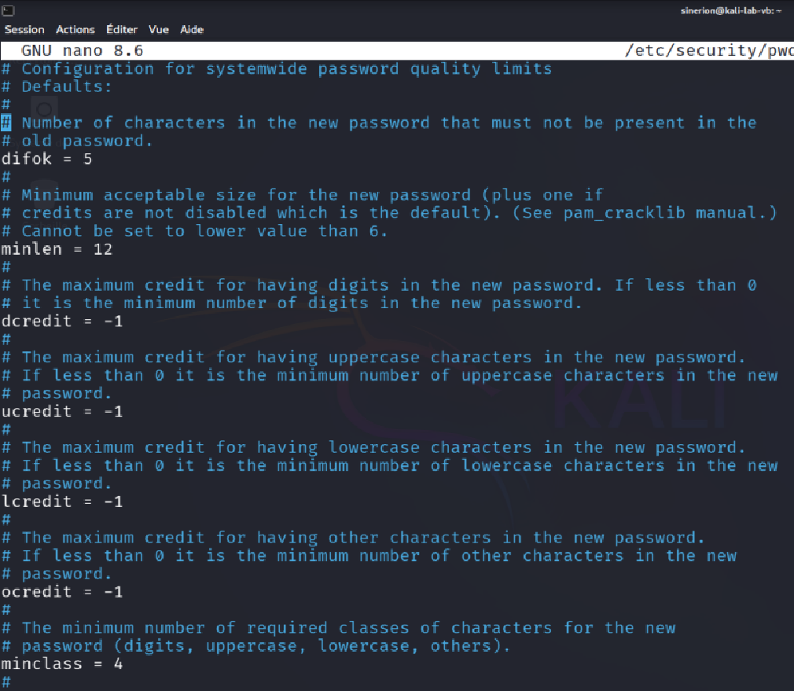

# Mini-projet 1 : Fondamentaux et Identification/Authentification

## Partie 1B : Mise en place d'une politique de mot de passe (complexité, renouvellement)

1. Connexion à la VM Kali Linux (ou Ubuntu)
    - Démarrez votre VM Kali Linux (ou Ubuntu) et connectez-vous avec votre compte utilisateur.
    - Ouvrez un terminal.
2. Compréhension théorique : politiques de mot de passe
3. Installation du module pwquality (si nécessaire) :
    
    ```bash
    sudo apt install libpwquality-tools
    sudo apt install libpam-pwquality
    ```
    
4. Configuration de la Politique de Mot de Passe avec pwquality :
    
    ```bash
    sudo nano /etc/security/pwquality.conf
    ```
    
    - Configuration /etc/security/pwquality.conf :
        
        ```bash
        minlen = 12
        minclass = 4
        ucredit = -1
        lcredit = -1
        dcredit = -1
        ocredit = -1
        maxrepeat = 3
        maxsequence = 3
        difok = 5
        gecoscheck = 1
        ```
        
        
        
    - Sauvegardez les modifications dans nano.
5. Application de la Politique de Mot de Passe via PAM :
    - Il faut maintenant dire à PAM d'utiliser le module pwquality lors du changement de mot de passe. Ceci se configure dans les fichiers de configuration PAM.
        
        ```bash
        sudo nano /etc/pam.d/common-password
        ```
        
    - Ajoutez pam_pwquality.so avant pam_unix.so et après pam_deny.so (si présent), et ajustez les options pour pam_unix.so pour qu'il ne fasse pas de vérification de complexité (car pam_pwquality.so le fera). La ligne modifiée devrait ressembler à :
        
        ```bash
        password    requisite    pam_pwquality.so retry=3
        password    required     pam_unix.so sha512 shadow nullok try_first_pass use_authtok
        ```
        
        - requisite pam_pwquality.so retry=3 : Indique à PAM d'exécuter pam_pwquality.so. requisite signifie que si ce module échoue, l'authentification échoue immédiatement. retry=3 permet à l'utilisateur de réessayer 3 fois de saisir un mot de passe valide avant d'abandonner.
        - required pam_unix.so ... : Le module pam_unix.so est toujours nécessaire pour gérer les mots de passe Unix traditionnels. Les options sha512 shadow nullok try_first_pass use_authtok sont des options courantes pour ce module et peuvent être conservées.
        - Normalement, le fichier complet est comme ci-dessous :
            
            ```bash
            # /etc/pam.d/common-password - password-related modules common to all services
            # here are the per-package modules (the "Primary" block)
            password requisite pam_pwquality.so retry=3
            password required pam_unix.so sha512 shadow nullok try_first_pass use_authtok
            # here's the fallback if no module succeeds
            # password required pam_deny.so
            # prime the stack with a positive return value if there isn't one already;
            # this avoids us returning an error just because nothing sets a success code
            # since the modules above will each just jump around
            # password required pam_permit.so
            # and here are more per-package modules (the "Additional" block)
            # password optional pam_gnome_keyring.so
            # end of pam-auth-update config
            ```
            
            
            
    - Sauvegardez les modifications dans /etc/pam.d/common-password.
6. Configuration du Renouvellement de Mot de Passe (Expiration) :
    - Politique d'expiration par défaut (pour les nouveaux utilisateurs) : Modifiez le fichier /etc/login.defs.
        
        ```bash
        sudo nano /etc/login.defs
        ```
        
        - Décommenter la ligne et modifier à :
            
            ```bash
            # PASS_MIN_DAYS (nombre minimum de jours avant depouvoir changer le mot de passe)
            # PASS_WARN_AGE (nombre de jours avant expiration pour commencer à avertir l'utilisateur)
            PASS_MAX_DAYS 90
            ```
            
        - Sauvegardez les modifications dans /etc/login.defs.
        - Modifier la politique pour un utilisateur existant (ex: etudiant (ou autre nom)) : Utilisez la commande chage.
    - Modifier la politique pour un utilisateur existant (ex: etudiant (ou autre nom)) : Utilisez la commande chage.
        
        ```bash
        # Pour voir la politique actuelle pour l'utilisateur etudiant (ou autre nom) :
        sudo chage -l [user]
        
        # Expiration maximale de 90 jours pour l'utilisateur
        sudo chage -M 90 [user]
        ```
        
        
        
7. Test de la Politique de Mot de Passe :
    
    ```bash
    # Changez le mot de passe de l'utilisateur etudiant (ou autre nom)
    passwd etudiant
    ```
    
    - Testez différents mots de passe :
        - Mdp trop court : Mdp1!
        - Mdp sans chiffres : toutenminuscules
        - Mdp qui ne respecte pas tout : MOTDEPASSE123!
        - Mdp qui respecte tout : M@tDeP@$$3_Compl3xe!
        
        
        
        
        
    - Vérifiez l'expiration du mot de passe
        
        ```bash
        # Force l'expiration immédiate du mot
        # Si connexion via SSH --> changement dès connexion
        sudo chage -d 0 etudiant
        ```
        

## Partie 1C : Configuration de l'authentification SSH avec échange de clés

1. Générer la paire de clés SSH (sur la VM Kali - client) :
    
    ```bash
    # Mettre une passphrase, garder l'emplacement par défaut ()
    ssh-keygen [-t rsa]
    ```
    
    
    
2. Copier la clé publique vers le serveur (VM Ubuntu) en utilisant ssh-copy-id :
3. [Prérequis : Installer SSH et le démarrer]
    
    ```bash
    # Installation de SSH sur Ubuntu
    sudo apt install openssh-server
    sudo systemctl start ssh
    sudo systemctl enable ssh
    ```
    
    ```bash
    ssh-copy-id [USER]@[IP_UBUNTU]
    ```
    
    ```bash
    # Alternative manuelle
    # Machine Kali :
    cat ~/.ssh/id_rsa.pub
    
    # Machine Ubuntu :
    mkdir -p ~/.ssh
    chmod 700 ~/.ssh
    nano ~/.ssh/authorized_keys # Puis coller la clé
    chmod 600 ~/.ssh/authorized_keys
    ```
    
    
    
4. Tester la connexion SSH par clé :
    
    ```bash
    # Passphrase demandée si configurée
    ssh [USER]@[IP]
    ```
    
    
    
5. Désactiver l'authentification par mot de passe sur le serveur SSH (VM Ubuntu) :
    
    ```bash
    sudo nano /etc/ssh/sshd_config # PasswordAuthentication no
    sudo systemctl restart sshd
    ```
    
6.  Vérifier la désactivation du mot de passe :
    - Depuis Kali, connexion par SSH (via clé) :
        
        ```bash
        ssh utilisateur@adresse_ip_ubuntu
        ```
        
    - Connexion via pwd forcée :
        
        ```bash
        ssh -o PreferredAuthentications=password [USER]@[IP_UBUNTU]
        ```
        
        
        

## Partie 1D : Introduction aux outils d'attaque et de test (Wireshark, Nmap, etc.)

1. Wireshark :
    
    ```bash
    wireshark &
    ```
    
    ### Paquets ICMP lors de la commande PING (Kali → Ubuntu) :
    
    
    
    ### Exercice :
    
    - IP Source : 10.0.2.3
    - IP Destination : 10.0.2.4
    - Type de message : ICMP Request (Source → Destinataire)
    
    
    
2. Nmap :
    
    ```bash
    # Scan de ports TCP SYN
    nmap -sS [IP]
    
    # Scan des ports UDP (optionnel, plus lent)
    nmap -sS -sU [IP]
    
    # Scan des ports les plus courants (plus rapide)
    nmap --fast [IP]
    
    # Découverte de services et versions :
    nmap -sV [IP]
    ```
    
    ### Exercice : Identifiez les ports TCP ouverts sur la VM Ubuntu, les services qui tournent sur ces ports (si Nmap les a détectés), et de comparer les résultats des différents types de scans (SYN, UDP, rapide, version detection)
    
    ```bash
    # SYN Scan
    Starting Nmap 7.95 ( https://nmap.org ) at 2026-02-03 20:19 CET
    Nmap scan report for 10.0.2.4
    Host is up (0.0022s latency).
    Not shown: 999 closed tcp ports (reset)
    PORT   STATE SERVICE
    22/tcp open  ssh
    MAC Address: 08:00:27:86:26:17 (PCS Systemtechnik/Oracle VirtualBox virtual NIC)
    
    Nmap done: 1 IP address (1 host up) scanned in 0.68 seconds
    ```
    
    ```bash
    # Service detection scan
    Starting Nmap 7.95 ( https://nmap.org ) at 2026-02-03 20:22 CET
    Nmap scan report for 10.0.2.4
    Host is up (0.0014s latency).
    Not shown: 999 closed tcp ports (reset)
    PORT   STATE SERVICE VERSION
    22/tcp open  ssh     OpenSSH 9.6p1 Ubuntu 3ubuntu13.14 (Ubuntu Linux; protocol 2.0)
    MAC Address: 08:00:27:86:26:17 (PCS Systemtechnik/Oracle VirtualBox virtual NIC)
    Service Info: OS: Linux; CPE: cpe:/o:linux:linux_kernel
    
    Service detection performed. Please report any incorrect results at https://nmap.org/submit/ .
    Nmap done: 1 IP address (1 host up) scanned in 1.26 seconds
    ```
    
    ```bash
    # Fast Scan
    Starting Nmap 7.95 ( https://nmap.org ) at 2026-02-03 20:24 CET
    Nmap scan report for 10.0.2.4
    Host is up (0.0017s latency).
    Not shown: 99 closed tcp ports (reset)
    PORT   STATE SERVICE
    22/tcp open  ssh
    MAC Address: 08:00:27:86:26:17 (PCS Systemtechnik/Oracle VirtualBox virtual NIC)
    
    Nmap done: 1 IP address (1 host up) scanned in 0.33 seconds
    ```
    
    ```bash
    # UDP Scan
    Starting Nmap 7.95 ( https://nmap.org ) at 2026-02-03 20:25 CET
    Stats: 0:10:38 elapsed; 0 hosts completed (1 up), 1 undergoing UDP Scan
    UDP Scan Timing: About 61.22% done; ETC: 20:42 (0:06:45 remaining)
    Stats: 0:13:36 elapsed; 0 hosts completed (1 up), 1 undergoing UDP Scan
    UDP Scan Timing: About 78.42% done; ETC: 20:42 (0:03:45 remaining)
    Nmap scan report for 10.0.2.4
    Host is up (0.0015s latency).
    Not shown: 999 closed udp ports (port-unreach)
    PORT     STATE         SERVICE
    5353/udp open|filtered zeroconf
    MAC Address: 08:00:27:86:26:17 (PCS Systemtechnik/Oracle VirtualBox virtual NIC)
    
    Nmap done: 1 IP address (1 host up) scanned in 1055.50 seconds
    ```
    
    Pour des raisons de simplicité, on peut combiner les différents arguments des commandes Nmap : 
    
    ```bash
    nmap -sS -sV -sU -F [IP]
    ```
    
    On remarque également que le scan UDP prend beaucoup plus de temps que les autres types de scan.
    
3. Netcat : Utilisé pour envoyer et recevoir des données sur le réseau, scanner des ports (TCP/UDP), écouter des connexions
    
    ```bash
    nc -zv adresse_ip_cible port_debut-port_fin
    ```
    
    ```bash
    ┌──(hackeros㉿kali-lab-vb)-[~]
    └─$ nc -zv 10.0.2.4 1-100
    10.0.2.4: inverse host lookup failed: Unknown host
    (UNKNOWN) [10.0.2.4] 22 (ssh) open
    ```
    
4. Tcpdump : Analyseur de paquets en ligne de commande (version console de Wireshark). Très puissant pour la capture de trafic réseau directement dans le terminal, sans interface graphique. Utile pour les scripts et les serveurs sans GUI
    
    ```bash
    sudo tcpdump -i eth0 -n icmp
    ```
    
    
    

## Partie 1E : Mise en place de protection basique

1. Vérification du Statut Actuel d'iptables (VM Ubuntu - Serveur) :
    - Se connecter à la VM Ubuntu (serveur)
        
        ```bash
        sudo iptables -L
        ```
        
        
        
2. Mise en Place d'une Règle de Firewall Basique : Bloquer le Ping (ICMP INPUT) :
    
    ```bash
    sudo iptables -A INPUT -p icmp --icmp-type echo-request -j DROP
    sudo iptables -L
    ```
    
    
    
3. Test de la Règle : Ping depuis la VM Kali Linux (Client) vers la VM Ubuntu (Serveur Exemple : VM Victime comme vu précédemment) :
    
    ```bash
    ping [IP_UBUNTU]
    ```
    


1. Autoriser le Trafic SSH Entrant (TCP INPUT port 22) :
    
    ```bash
    sudo iptables -A INPUT -p tcp --dport 22 -j ACCEPT
    ```
    

1. Test de la Règle SSH : Connexion SSH depuis la VM Kali Linux (Client) vers la VM Ubuntu (Serveur) :
    
    ```bash
    ssh utilisateur@adresse_ip_ubuntu
    ```
    


1. Politique par Défaut de la Chaîne INPUT (Optionnel, pour aller plus loin) :
    
    ```bash
    # Voir la politique par défaut
    sudo iptables -L -v
    ```
    
    
    
    ```bash
    # Modifier la politique par défaut en DROP (whitelist à définir)
    sudo iptables -P INPUT DROP
    ```
    

1. Suppression des Règles iptables (Nettoyage) :
    
    ```bash
    sudo iptables -L --line-numbers
    sudo iptables -D INPUT [NUM_LINE]
    sudo iptables -F INPUT # Vider toute les règles INPUT
    
    # Réinitialiser complètement iptables
    # (vider toutes les chaînes et remettre les politiques par défaut) :
    sudo iptables -X
    sudo iptables -F
    sudo iptables -P INPUT ACCEPT
    sudo iptables -P OUTPUT ACCEPT
    sudo iptables -P FORWARD ACCEPT
    ```