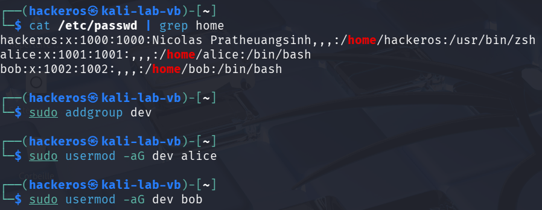
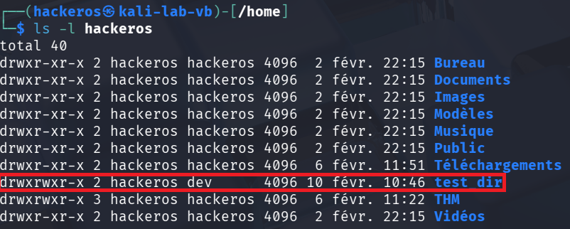

# Mini-projet 2 : Contrôle d'Accès et Cryptographie

## Partie 2A : Configuration des permissions sur un système Linux

### 1. Création d'Utilisateurs et Groupes (si nécessaire):

```bash
sudo adduser alice
sudo adduser bob
sudo addgroup dev
sudo usermod -aG dev alice
```



### 2. Création de Fichiers et Répertoires de Test:

### 3. Affichage des Permissions Actuelles:


### 4. Modification des Permissions avec chmod:

Exercices:

- Donner les droits de lecture et écriture à l'utilisateur alice sur le fichier test_file.txt
et aucun droit pour les autres.
    
    
    
- Donner les droits de lecture, d'écriture et d'exécution au groupe dev sur le répertoire test_dir.
    
    
    

### 5. Changement de Propriétaire et de Groupe avec chown et chgrp

### 6. Vérifications


## Partie 2B : Mise en place d'un chiffrement basique avec OpenSSL.

### 1. Préparation des Données:

```bash
openssl enc -aes-256-cbc -e -in secret.txt -out secret.enc -k "password123"
```

### 2. Chiffrement du Fichier avec OpenSSL:


### 3. Visualisation du Fichier Chiffré:


### 4. Déchiffrement du Fichier avec OpenSSL:

```bash
openssl enc -aes-256-cbc -d -in secret.enc -out secret_dechiffre.txt -k "password123" 
```

### 5. Vérification du Fichier Déchiffré:


### 6. Expérimentations (Bonus):

```bash
openssl enc -des -e -in secret.txt -out secret.enc -k "password123"
```

Tentative de déchiffrement avec la mauvaise clé :

```bash
openssl enc -des -d -in secret.txt -out secret_deciphered.txt -k "password1234"
```


Variation de la longueur de la clé pour AES:


## Partie 2C : Création et manipulation de certificats auto-signés

### 1. Génération d'une Clé Privée:

```bash
openssl genrsa -out cle_privee.pem 2048
```

### 2. Génération d'une Requête de Signature de Certificat (CSR) :

```bash
openssl req -new -key cle_privee.pem -out requete.csr
```


### 3. Génération du Certificat Auto-Signé :

```bash
openssl x509 -req -in requete.csr -signkey cle_privee.pem -out certificat.crt -days 365
```


### 4. Visualisation du Certificat :

```bash
openssl x509 -in certificat.crt -text -noout
```


### 5. Manipulation des Certificats:

- Conversion de Format:
    
    ```bash
    openssl x509 -in certificat.crt -outform DER -out certificat.der
    ```
    
    
    
- Extraction de la clé publique:
    
    ```bash
    openssl x509 -in certificat.crt -pubkey -noout > cle_publique.pem
    ```
    
    
    

### 6. Limites des Certificats Auto-Signé

- Les navigateurs et les applications ne font généralement pas confiance aux certificats auto-signés car ils n'ont pas été signés par une autorité de certification de confiance. Vous aurez un message d'avertissement ou une erreur lors de l'utilisation d'un tel certificat.
- Les certificats auto-signés sont utiles pour les tests, les environnements de développement, ou
les communications internes, mais ils ne conviennent pas aux environnements de production ou
les communications avec des utilisateurs externes.

## Partie 2D : Mise en place d'un VPN (OpenVPN)

### 1. Installation d'OpenVPN:

```bash
sudo apt update
sudo apt install openvpn easy-rsa
```

### 2. Configuration du Serveur OpenVPN:

- Création du répertoire et des fichiers de configuration:
    
    ```bash
    sudo cp /usr/share/doc/openvpn/examples/sample-config-files/server.conf /etc/openvpn/server/server.conf
    ```
    
- Modification du fichier /etc/openvpn/server/server.conf:
    
    
    

### 3. Génération des Clés et des Certificats pour le Serveur:

- Initialisation des outils easy-rsa:
    
    ```bash
    sudo make-cadir /etc/openvpn/easy-rsa
    cd /etc/openvpn/easy-rsa
    sudo ./easyrsa init-pki
    ```
    
    
    
- Création de l'autorité de certification (CA):
    
    ```bash
    sudo ./easyrsa build-ca nopass
    ```
    
    
    
- Création du certificat du serveur:
    
    ```bash
    sudo ./easyrsa build-server-full server nopass
    ```
    
    
    
- Génération des paramètres Diffie-Hellman:
    
    ```bash
    sudo openssl dhparam -out dh.pem 2048
    ```
    
- Copie des clés et certificats dans le répertoire de configuration d'OpenVPN:
    
    ```bash
    sudo cp pki/ca.crt /etc/openvpn/server
    sudo cp pki/issued/server.crt /etc/openvpn/server
    sudo cp pki/private/server.key /etc/openvpn/server
    sudo cp dh.pem /etc/openvpn/server
    ```
    
- Adaptation des droits:
    
    ```bash
    sudo chown -R root:root /etc/openvpn/easy-rsa
    ```
    

## 4. Configuration du Client VPN:

- Création des clés et certificats pour le client:
    
    ```bash
    sudo ./easyrsa build-client-full client1 nopass
    ```
    
- Récupération du fichier de configuration:
- Copie du fichier client1.conf
    
    
    
- Copiez également le fichier /etc/openvpn/easy-rsa/pki/ca.crt:
    
    ```bash
    scp /etc/openvpn/easy-rsa/pki/ca.crt analyste@10.0.2.15:/home/analyste/
    ```
    
    
    

### 5. Démarrage du Serveur OpenVPN:

- Démarrage d’OpenVPN:
    
    ```bash
    sudo systemctl enable openvpn-server@server
    sudo systemctl start openvpn-server@server
    ```
    

### 6. Connexion du Client VPN:

- Connectez vous au serveur VPN en utilisant le fichier de configuration client.ovpn
    
    ```bash
    sudo openvpn --config client.ovpn
    ```
    
    
    

### 7. Vérification du Tunnel VPN:

- Sur votre poste client, vérifiez que vous avez une nouvelle interface réseau tun0 (ou tun1 si vous avez déjà un VPN).
    
    
    
    
    

## Annexe :

### **Étape 1 : Activation du routage sur le Serveur (NAT):**

1. Autoriser le transfert de paquets IPv4 :
    
    ```bash
    sudo sysctl -w net.ipv4.ip_forward=1
    ```
    
2. Configurer la translation d'adresse (MASQUERADE) : Cela permet aux paquets du client (10.8.0.2) de sortir sur Internet avec l'IP publique du serveur.
    
    ```bash
    sudo iptables -t nat -A POSTROUTING -s 10.8.0.0/24 -o eth0 -j MASQUERADE
    ```
    

### Étape 2 : Vérification de la sortie sur le Client:

1. Test de résolution DNS et connectivité :
    
    ```bash
    ping -c 4 google.com
    ```
    
    
    
2. Vérification de l'IP de sortie : Utilisez une commande pour afficher votre adresse IP publique vue par Internet.
    
    ```bash
    curl ifconfig.me
    ```
    
    
    
    
    

### Étape 3 : Simulation de changement de pays: